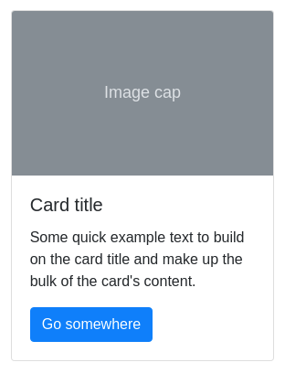

# Карточки

Необходимо реализовать компонент карточек, который можно использовать следующим образом:

В качестве CSS можно использовать Bootstrap 5, а сгенерированную разметку можно посмотреть [на странице](https://getbootstrap.com/docs/5.3/components/card/).

Стили и пример разметки находятся в папке [markup](https://github.com/netology-code/ra16-homeworks/blob/ra-new/composition/cards/markup). Разметка приведена для примера, вы можете реализовать ее самостоятельно.

Обязательно необходимо реализовать карточки, показанные на изображениях выше. Дополнительные варианты карточек из примеров можно реализовать по желанию.
